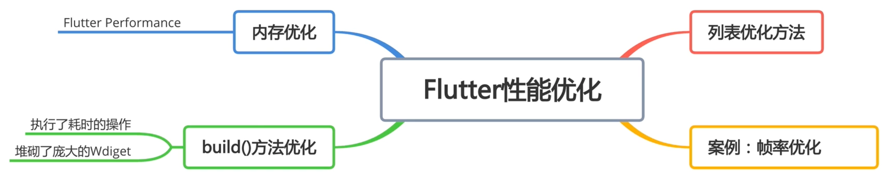
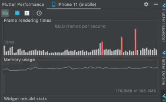
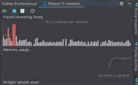
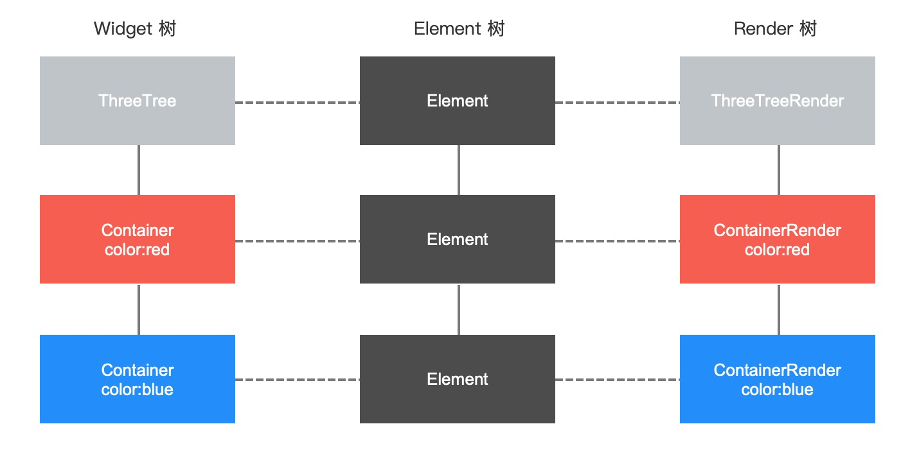

### 解决安卓和苹果系统沉浸式播放状态栏兼容


```dart
  Widget build(BuildContext context) {
    return Scaffold(
      body: MediaQuery.removePadding(
      removeTop: Platform.isIOS,
      context: context,
      child: Column(children: [
        // 修复iOS平台状态栏
        NavigationBar(
          color: Colors.black,
          statusStyle: StatusStyle.LIGHT_CONTENT,
          height: Platform.isAndroid ? 0 : 46,
        ),
        _videoView(),
        Text('视频详情页, vid: ${widget.videlModel.vid}'),
        Text('视频详情页, title: ${widget.videlModel.title}'),
      ]),
    ));
  }
```

### iOS退出全屏问题修复

```dart
// 特别针对 iOS 修复退出全屏问题
void _fullScreenListener() {
  Size size = MediaQuery.of(context).size;
  if (size.width > size.height) {
    OrientationPlugin.forceOrientation(DeviceOrientation.portraitUp);
  }
}
```

### 安卓端后台切换APP再次进入问题修复

- 在 `APP` 中，返回桌面，退出 `APP` 放入后台，再进入时，我们状态栏就 **“坏了”**
- 所以我们必须在 `APP` 中能监听 `APP` 的状态：从后台再次进入APP
- 有了这个监听我们就能每次后台进入修复一次状态栏问题
- 这个时候我们需要让这个 `Widget` 去实现 `WidgetsBindingObserver` 这个抽象类
- 然后就可以注册声明周期函数

```dart
///监听应用生命周期变化
@override
void didChangeAppLifecycleState(AppLifecycleState state) {
  super.didChangeAppLifecycleState(state);
  print(':didChangeAppLifecycleState:$state');
  switch (state) {
    case AppLifecycleState.inactive: // 处于这种状态的应用程序应该假设它们可能在任何时候暂停。
      break;
    case AppLifecycleState.resumed: //从后台切换前台，界面可见
      //fix Android压后台首页状态栏字体颜色变白，详情页状态栏字体变黑问题
      changeStatusBar();
      break;
    case AppLifecycleState.paused: // 界面不可见，后台
      break;
    case AppLifecycleState.detached: // APP结束时调用
      break;
  }
}
```

```dart
void initState() {
  super.initState();

  WidgetsBinding.instance?.addObserver(this);

  _controller = TabController(length: categoryList.length, vsync: this);
  HiNavigator.getInstance().addListener(this.listener = (current, pre) {
    // this._currentPage = current.page;
    print('home:current:${current.page}');
    print('home:pre:${pre.page}');
    if (widget == current.page || current.page is HomePage) {
      print('首页: onResume');
    } else if (widget == pre?.page || pre?.page is HomePage) {
      print('首页: onPause');
    }

    // 当页面返回到首页恢复首页的状态栏样式
    // 为什么出现这个问题，就是视频详情页引起的
    if (pre?.page is VideoDetailPage && !(current.page is ProfilePage)) {
      var statusStyle = StatusStyle.DARK_CONTENT;
      changeStatusBar(color: Colors.white, statusStyle: statusStyle);
    }
  });

  loadData();
}
```

> 其实若有其他这样沉浸时状态栏页面切换修复也可以用这样的方式修复。

### Flutter中性能优化

- 常见优化的四个方向:



- 优化前后对比：





### 模块化

`flutter create --template=package hi_barrage`


## Flutter的渲染机制

